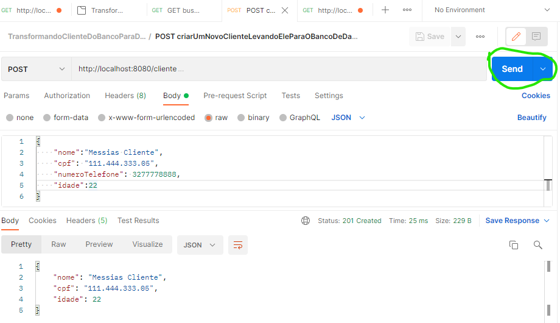

<H1> DTO - DATA TRANSFER OBJECT</H1>

>**O que é um dto?**
> > é um transformador de dados que vem do banco, ou vão para ele, em objeto.

>**Por que isso é importante?**
> > Em sua grande maioria, objeto que salvamos no banco de dados tem muitas informações desnecessarias para o saber do usuario,
> como por exemplo: data de inclusão, de alteração, identificador, coisas importantes para o banco que não são para o usuario final.
> Sabendo disso criamos o DTO para salvar no banco de dados todas informações necessarias e exibir para o usuario somente as que ele precisa.

>**Como fazemos essa conversão do banco para o usuario?**
> > Podemos usar alguns artificios como mostrei no service, lá, eu usei conversores, aqueles são basicos, por isso não recomendo, mas já da para trabalhar.

> **Como tudo isso acontece?**
> > pegamos dados do banco, transformamos ele para que o usuario entenda e seja legal para ele. Ou pode ser o inverso, pegamos as informações que precisamos do usuario e transformamos de maneira que o banco de dados aceite.

<h3>O que utilizamos no projeto:</h3>

 Tudo que foi utilizado aqui é pensando em programadores iniciantes, que estão começando agora na area da programação.

O projeto foi separado em alguns arquivos, dentre eles:

<h3>Criação de novos clientes no banco de dados:</h3>

Veja, eu insiro os dados e quando executo o send ele me salva no banco e me retorna um DTO com a resposta do que foi salvo.

<h3>Busca por clientes no banco de dados</h3>
Veja que nas linhas o que nos traz.  

>**Controller:**
> estes são responsaveis pela chamada do front end, ou seja, o controlador e gerente do projeto, é ele que vai dizer onde buscar.

>**Service:**
> Onde estão localizadas as logicas e toda funcionalidade do nosso projeto.

>**Entity:**
>São as entidades do projeto, aqui são os dados explicitos que vão ser inseridos no banco de dados.

>**Repository:**
> é o que vamos chamar para acessar nosso banco de dados.

>**DTO:**
>Classes responsavel por fragmentar o Entity, objeto que o usuario final precisa conhecer.

<h3> Coisas que não precisa entender:</h3>

 os transformadores que utilizamos com map no Cliente Service. É algo que precisa ter um pouco mais de conhecimento em Java.

<h3>JSON UTILIZADO NO POSTMAN</h3>

~~~json
{
  "info": {
    "_postman_id": "ec7316f7-a68b-420a-ab80-1cd5fb6984d8",
    "name": "TransformandoClienteDoBancoParaDTO",
    "schema": "https://schema.getpostman.com/json/collection/v2.1.0/collection.json"
  },
  "item": [
    {
      "name": "GET buscarClientesDoBanco",
      "request": {
        "method": "GET",
        "header": [],
        "url": {
          "raw": "http://localhost:8080/cliente",
          "protocol": "http",
          "host": [
            "localhost"
          ],
          "port": "8080",
          "path": [
            "cliente"
          ]
        }
      },
      "response": []
    },
    {
      "name": "POST criarUmNovoClienteLevandoEleParaOBancoDeDados",
      "request": {
        "method": "POST",
        "header": [],
        "body": {
          "mode": "raw",
          "raw": "{\r\n    \"nome\":\"Messias Cliente\",\r\n    \"cpf\": \"111.444.333.05\",\r\n    \"numeroTelefone\": 3277778888,\r\n    \"idade\":22\r\n}",
          "options": {
            "raw": {
              "language": "json"
            }
          }
        },
        "url": {
          "raw": "http://localhost:8080/cliente",
          "protocol": "http",
          "host": [
            "localhost"
          ],
          "port": "8080",
          "path": [
            "cliente"
          ]
        }
      },
      "response": []
    }
  ]
}

